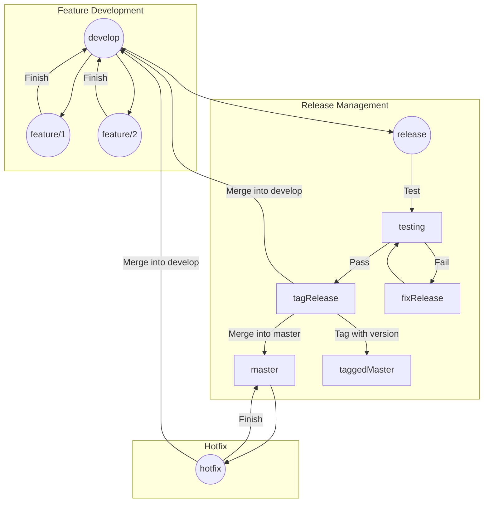

# GitFlow Workflow [](https://skillicons.dev) 


GitFlow is a branching model for Git, which helps teams manage and streamline their development workflow. It defines a strict branching model designed around the project release.

## Introduction

GitFlow provides a set of guidelines for a branching strategy that is suitable for managing larger projects with multiple contributors. It defines specific branches for different types of work and provides rules for how and when these branches should be created, merged, and deleted.

## Branches

- **Master:** The main branch where the latest production-ready code lives. It should always reflect the current state of the production environment.
- **Develop:** The development branch where new features are integrated and tested. It reflects the latest development changes and is where all feature branches are merged before a release.
- **Feature branches:** Branches created off of the develop branch for developing new features or enhancements. Once complete, they are merged back into the develop branch.
- **Release branches:** Branches created off of the develop branch when preparing for a new release. It's where final testing and bug fixing occur. Once ready, it's merged into both master and develop, and tagged with a version number.
- **Hotfix branches:** Branches created off of the master branch for fixing critical issues found in the production environment. Once fixed, they are merged into both master and develop.

## Workflow

1. Start a new feature: `git checkout -b feature/your-feature develop`
2. Develop the feature and commit changes: `git commit -am "Add new feature"`
3. Finish the feature: `git checkout develop` and `git merge --no-ff feature/your-feature`
4. Start a release: `git checkout -b release/x.x.x develop`
5. Test and prepare the release: `git commit -am "Release x.x.x"`
6. Finish the release: `git checkout master` and `git merge --no-ff release/x.x.x`, then `git tag -a x.x.x`
7. Merge the release changes back into develop: `git checkout develop` and `git merge --no-ff release/x.x.x`
8. If needed, create a hotfix branch: `git checkout -b hotfix/x.x.x master`
9. Fix the issue and commit changes: `git commit -am "Fix issue"`
10. Finish the hotfix: `git checkout master` and `git merge --no-ff hotfix/x.x.x`, then `git tag -a x.x.x`
11. Merge the hotfix changes back into develop: `git checkout develop` and `git merge --no-ff hotfix/x.x.x`

## GitFlow Diagram



## Conclusion

GitFlow provides a structured workflow that helps teams manage releases, hotfixes, and feature development effectively. By following the GitFlow branching model, teams can maintain a stable codebase and streamline their development process.
```
